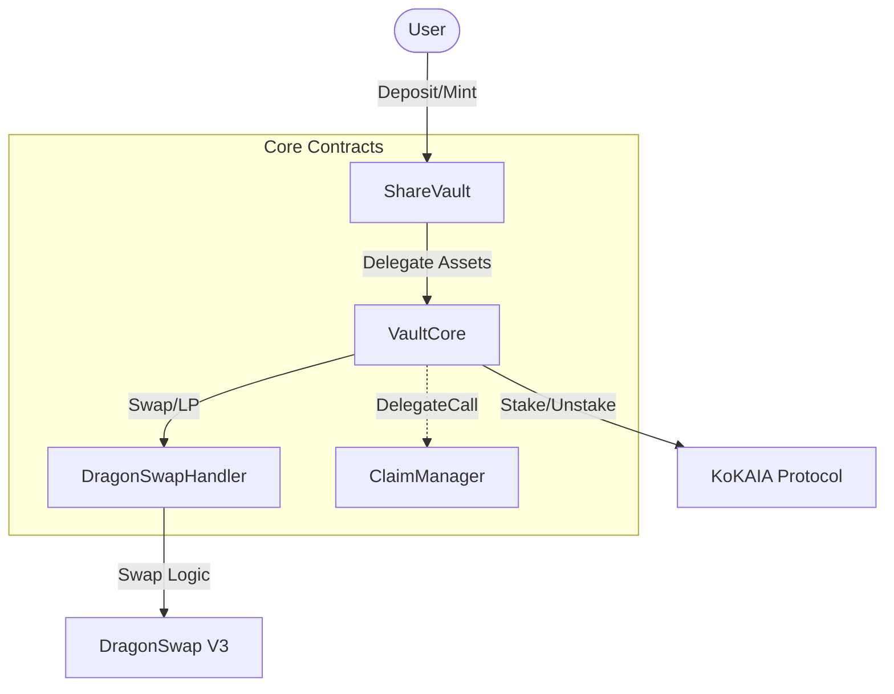

# Kommune-Fi Vault Contracts (Audit Version)

Multi-Strategy yield optimization vault on Kaia blockchain. Refactored and frozen for security audit.


## 🔒 Audit Overview
This version implements the **Stable Strategy** (100% KoKAIA Staking) with strict separations of concern for security.

*   **Logic Deduplication**: `ShareVault` refactored to minimize code paths.
*   **Documentation**: fully documented with NatSpec conventions.
*   **Upgrade Safety**: UUPS Proxy pattern with `SharedStorage` layout protection.
*   **Test Coverage**: Functional tests for Deposit, Withdraw, and Proxy Upgrades.

---

## 🏗 System Architecture



### Core Components
| Contract | Role | Key Responsibility |
|----------|------|--------------------|
| **ShareVault.sol** | Frontend | ERC-4626 Interface. Manages User Shares. |
| **VaultCore.sol** | Backend | Asset Custody. Executes Staking & Allocations. |
| **DragonSwapHandler.sol** | DEX Handler | Isolates Swap/Liquidity Logic from Core. |
| **ClaimManager.sol** | Unstaking | Manages 7-day unbonding period & claiming. |
| **SharedStorage.sol** | Storage | Prevents storage collisions for `delegatecall`. |

---

## 🛠 Quick Start

### 1. Installation
```bash
npm install
npx hardhat compile
```

### 2. Deployment (Audit Setup)
Deploys the clean, optimized suite to **Kairos Testnet**.
```bash
npx hardhat run scripts/deployAudit.js --network kairos
```
> **Artifact**: `deployments/testnet/audit-kairos.json`

### 3. Verification
**Functional Test (In/Out)**:
```bash
npx hardhat run scripts/testDepositWithdraw.js --network kairos
```

**Upgradeability Test (UUPS Proxy)**:
```bash
npx hardhat run scripts/testAuditUpgrade.js --network kairos
```

---

## 📂 Repository Structure

*   `src/` - **Audit Scope**. The 5 core Solidity contracts.
*   `scripts/` - **Validation Scripts**. Minimal set for audit verification.
*   `deployments/` - **Active Config**. Only contains the current audit deployment.
*   `docs/` - **Documentation**. Detailed guides and specs.
    *   [Audit Guide](docs/audit/audit-readme.md)
    *   [Deployment Guide](docs/deployment/deployment-guide.md)
    *   [Storage Layout](docs/architecture/storage-layout.md)

> **Note**: Legacy code and scripts have been moved to `_archive/` and are excluded from the audit scope.

---

## 📊 Deployment Addresses (Kairos)
*Latest deployment from `deployments/testnet/audit-kairos.json`*

| Contract | Address |
|----------|---------|
| **ShareVault** | `0xEce34C711903b0884DB9B2248f498796BA36980B` |
| **VaultCore** | `0x7BFFAb552E3CA60C9993C05bF66D078a3aDc09e6` |
| **DragonSwapHandler** | `0xd998B223dfD57D74fC15bbf127Ad32bbC4B04320` |
| **ClaimManager** | `0x1A9914728e101d2cEE477C3c1db98519B7B08B1D` |
